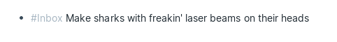
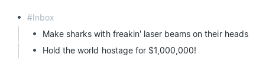
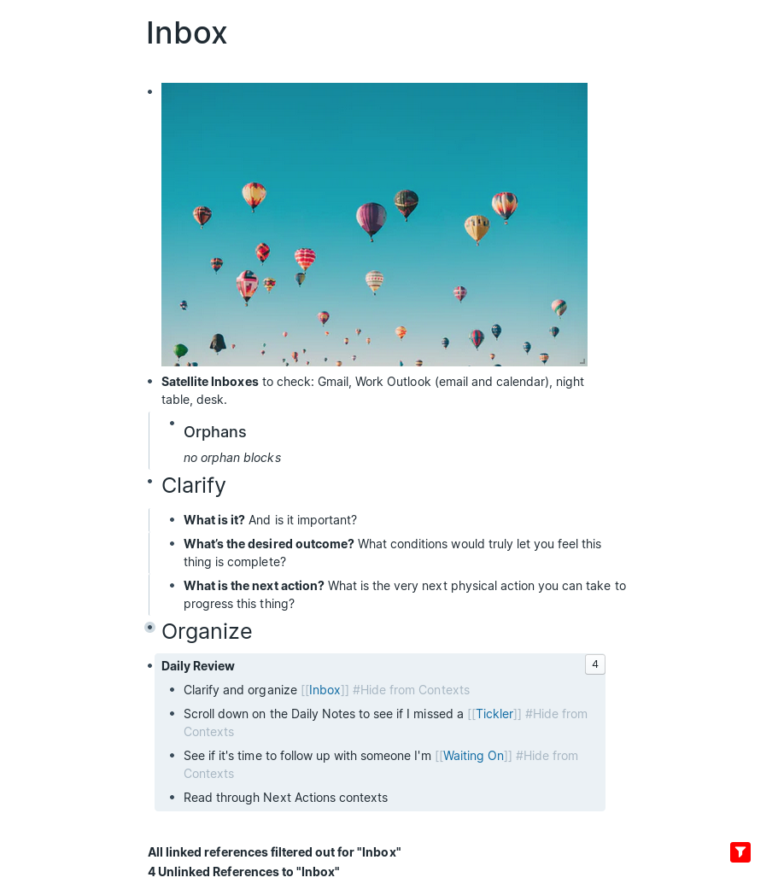
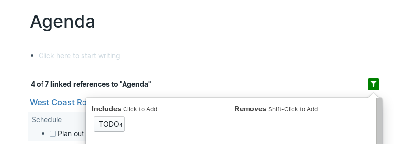
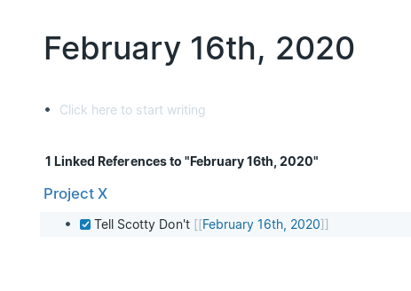
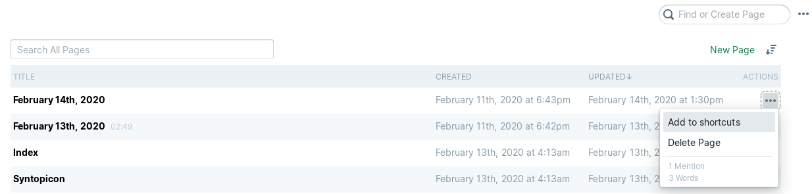
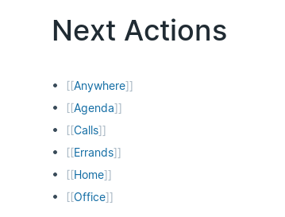
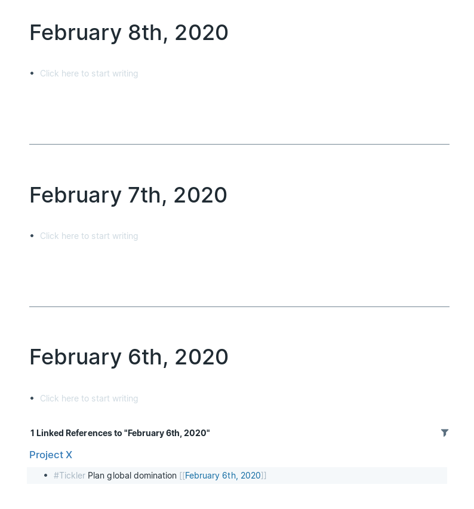
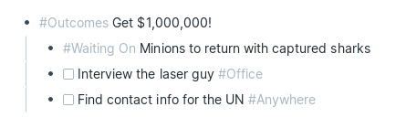
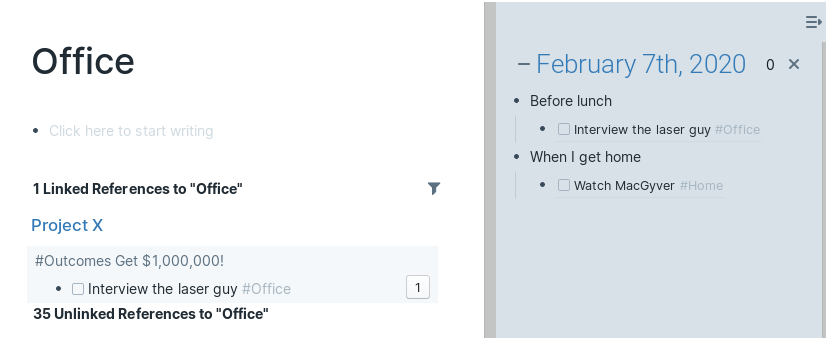

+++
title = "GTD in Roam"
date = "2020-02-09T08:19:51-08:00"
image = "gtd-plus-roam.png"
+++

[Roam](https://roamresearch.com/) is a great note taking app where each note page tracks its [linked and unlinked references](https://roamresearch.com/#/v8/help/page/Vu1MmjinS). Even without explicitly linking pages Roam will create connections and help you manage your disparate thoughts.

When I was reading through the [Welcome to Roam](https://roamresearch.com/#/v8/help/page/1308) documentation I came across notes on how to setup [Getting Things Done in Roam](https://roamresearch.com/#/v8/help/page/AImpYBcPs). It was a good starting point but it doesn't use GTD Contexts to narrow down Next Actions and relies a lot on drag-and-drop to move actions around. Both of these factors limit the total number of tasks that can be managed without getting overloaded and make it harder to do GTD on a phone.

So I've come up with a system that uses Roam's linked references to gather tasks by their context tag, and let me move tasks around without leaving the keyboard.

## Capturing

Instead of a specific Bucket page for adding new ideas, I write ideas down wherever I am, along with an *#Inbox* tag. This has the nice effect of keeping the idea on the page where I first thought of it (and where it's surrounded by related information). This could be a project page or the Daily Note. Putting new task ideas on the Daily Note page actually makes it possible to track the time between thinking of a it and completing it.

Sometimes I save a bit of typing by adding multiple ideas under an *#Inbox* block. Roam will link the whole thing to the **Inbox** page.

## Clarifying/Organizing

To remind myself of all my non-Roam (a.k.a. satellite) inboxes I have a list of them on the **Inbox** page. Places like my personal and work emails, my night table, or my desk. I also added orphaned blocks using Roam's */Find orphan blocks* command. (The picture of balloons by [ian dooley](https://unsplash.com/@sadswim) is there to make processing my Inbox during a Daily Review a bit more fun!)

I start my Daily Review by going to the **Inbox** page, reviewing each linked reference in order, and asking myself GTD's clarifying questions:  

- What is it?
- What's the desired outcome?
- What's the next action(s)?

With the answers to these questions I deal with it in one of the following ways:

- **Do It** if it takes <2mins
- **Delegate It** if someone else is handling it. In which case I'll tag their name and *#Waiting On*
- **Defer It** if it's for a later time.
    - Either by creating a calendar event (outside of Roam)
    - Creating a phone reminder (if it's something I need to do at a specific time) 
    - Tagging *#Tickler* and a future date using */Date Picker* if it's something I want to sort at a later time
    - Or tagging it with related topics and *#Someday/Maybe*
- **Tidy It** by creating Next Action(s), *#Outcomes*, or keeping it somewhere as reference
- **Trash It** if it's not necessary anymore

## Next Actions

To next actions I add a checkbox (using **Ctrl + Enter**), tags for related topics, and a GTD context tag like:

- *#Anywhere*
- *#[[Someone's Name]]* and *#Agenda*
- *#Calls*
- *#Errands*
- *#Home*
- *#Office*

Roam linked references can be filtered (and Roam will even remember filters across browsers and sessions). So for each of these context pages, I've setup filters to only show linked references that are **TODO**s.

I like to complete actions by tagging the current day (using the */Today* command) and then checking it off. This adds it to the Daily Note where I journal about what I did during the day. 

## Roam Shortcuts

Roam's left sidebar has space for a list of shortcuts. I added the following to make all parts of the GTD workflow easily accessible:

- Inbox
- Next Actions
- Outcomes
- Someday/Maybe

I try to keep this list short because scrolling is limited on mobile. On a desktop computer shortcuts can be added by going to **All Pages**, finding the context page, clicking **...** (in the ACTIONS column), and then **Add to shortcuts**.
                                                                      

On the **Next Actions** page I have a list of different contexts. If you have only a few contexts, go ahead and add them to the shortcuts on the left sidebar.

## Deferring Actions with *#Tickler* and *#Waiting On*

The original version of GTD had physical folders for each day of the month, each month of the year, and then future years as needed. When using a digital Tickler like Roam, I prefer to skip the folders for months and years and just tag future dates directly (using the */Date Picker* command). It helps that Roam will automatically turn those future dates into a Daily Note when the date comes about.

I used to worry that I might miss a *#Tickler* or *#Waiting On* task, if I didn't open Roam every day. But Roam makes it easy to scroll down on the Daily Notes page and see past Daily Notes. To help me remember to do this, I added a reminder to my Daily Review instructions.

If I scroll down I'll either see blank notes with linked references to *#Tickler* or *#Waiting On* tasks that I missed or I'll see the last Daily Note where I wrote a journal entry. Once I see that last journal entry I'll know that I won't need to look any further back.

## Projects/Outcomes

"Projects" are what GTD calls any short term goal that takes multiple actions (typically in different contexts). This confused me until I read this article by [Laura Earnest](http://lauraearnest.com/simplifying-getting-things-done-projects/). In Roam I avoid using the term project and instead handle multiple steps by creating an *#Outcomes* block describing what I want to achieve and listing next actions beneath it.

## Plans

I have a page with a copy of the **Natural Planning Model** that I'll consult when planning long term projects:

> 1. Define purpose and principles – Why are you doing this? What are the constraints?
> 1. Visualise outcomes – What does success look like? How about wild success?
> 1. Brainstorm – What are all the ideas you can think of? Get the bad ones out of your head too.
> 1. Organise – What ideas will you use? Which are the most important? What order will you do them in?
> 1. Identify next actions – What is the very next physical action you can take to progress the project?



I also have a page for GTD **Horizons**. This is the only GTD list where I keep notes on the page itself, rather than use Roam's' linked references. This is fine since Horizon planning is very structured and Horizon items change infrequently.

>- Horizon 5: Purpose and principles – The purpose, mission and values at the heart of your existence;
>- Horizon 4: Vision – A broad overview of what success looks like for you on a 3 – 5 years timeline;
>- Horizon 3: Goals – The larger outcomes you’d like to make manifest in the next 1 – 2 years;
>- Horizon 2: Areas of Focus and Accountabilities – The roles and areas of life your committed to focussing on in the next 12 months;
>- Horizon 1: Current projects – The list of any outcome you are committed to realising in < 12 months; and
>- Ground: Current actions – The comprehensive action list at the core of getting things done.



## Reference

This is the easiest part of GTD to handle in Roam. Roam's reference linking will naturally bring notes back up when they're written about again. When I'm writing I just try to maintain consistent terminology and let Roam do its thing.

## Reviews

I start my Daily Reviews on the **Inbox** page. Clarifying and organizing what Roam has linked, and then looking through my list of satellite inboxes. Then I'll go to the **Daily Notes** page (using **Alt + D**) and scroll down to see if I missed any *#Tickler* or *#Waiting On* tasks. I could also go to the **Tickler** or **Waiting On** pages directly but these lists can get long (for me at least) and Roam has no way of sorting by date. Plus I use Roam frequently enough that I have yet to need to scroll far. Finally I'll plan my day by reading through my Next Actions, and adding block references in the Daily Note I open in the right sidebar.

Once a week, in addition to the usual Daily Review, I'll also review my **Outcomes**, **Someday/Maybe**, and **Horizons** pages to see if there's anything that I now want to tackle.

Once a year I'll also review a [summary of GTD](https://fastertomaster.com/getting-things-done-david-allen/), compare it to my **GTD** page in Roam, and think about where my system can be improved. And that's how to do GTD with Roam's linked references and filtering!