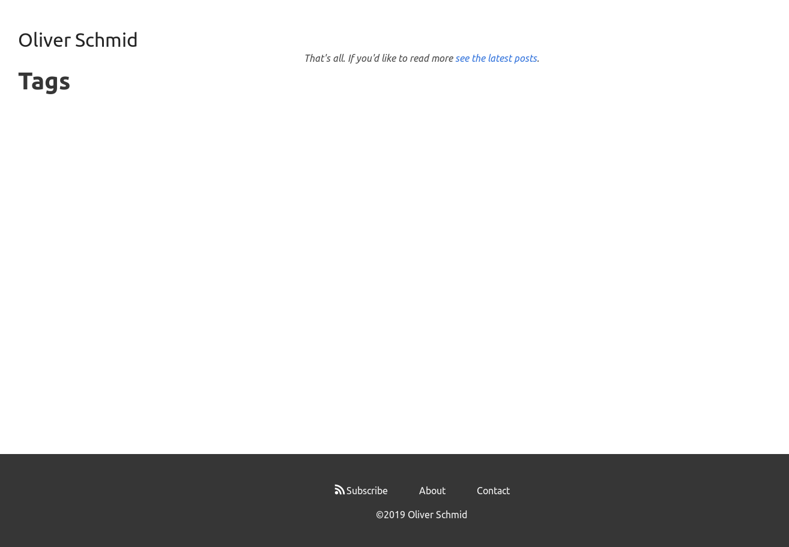

+++
title = "Website Updates"
date = "2019-10-13T07:34:48-07:00"
image = ""
+++
I noticed recently that the site broke. Somehow Hugo had stopped rendering posts or tags and the homepage looked like it had no content.

Turns out a Page's `.URL` field was deprecated for new syntax in an update of Hugo:

9:15:43 AM: WARN 2019/04/28 16:15:43 Page's .URL is deprecated and will be removed in a future release. Use .Permalink or .RelPermalink. If what you want is the front matter URL value, use .Params.url.

I'm not sure why exactly this broke things though. Back in April I configured Netlify to use a version of Hugo that still has a `.URL` field: 0.55.4. Maybe Netlify rebuilt my site in the intervening months?

In any case, this became a good moment to upgrade Hugo and give my site some much needed maintenance.

- So I got rid of some dead code from when I was experimenting with [Netlify Functions](https://www.netlify.com/docs/functions/) and building the site using Gulp.
- Reran [webhint](https://webhint.io/scanner/) and [Lighthouse](https://web.dev/measure) and fixed some hints about security headers, resource crossorigin attribbutes, and upgrading to `sha384` for Subresource Integrity hashes.
- Updated my [robots.txt](/robots.txt) to skip some pages that aren't worth crawling.
- Moved my posts from `/post/<title>/` to the Hugo conventional `/posts/<title>/` and added redirects.
- Fixed up some width styling to make blog posts more readable.
- Increased the colour contrast of some lighter elements so that they meet accessibility standards
- Changed the colours of the pagination elements to draw people into reading the next page as opposed to noticing the current page number.
- Used the CSS grayscale filter to make the social media share links less noticeable.
- Added a search field for the site that uses [DuckDuckGo](https://duckduckgo.com/) as a backend.

It's been a fun bit of website design!