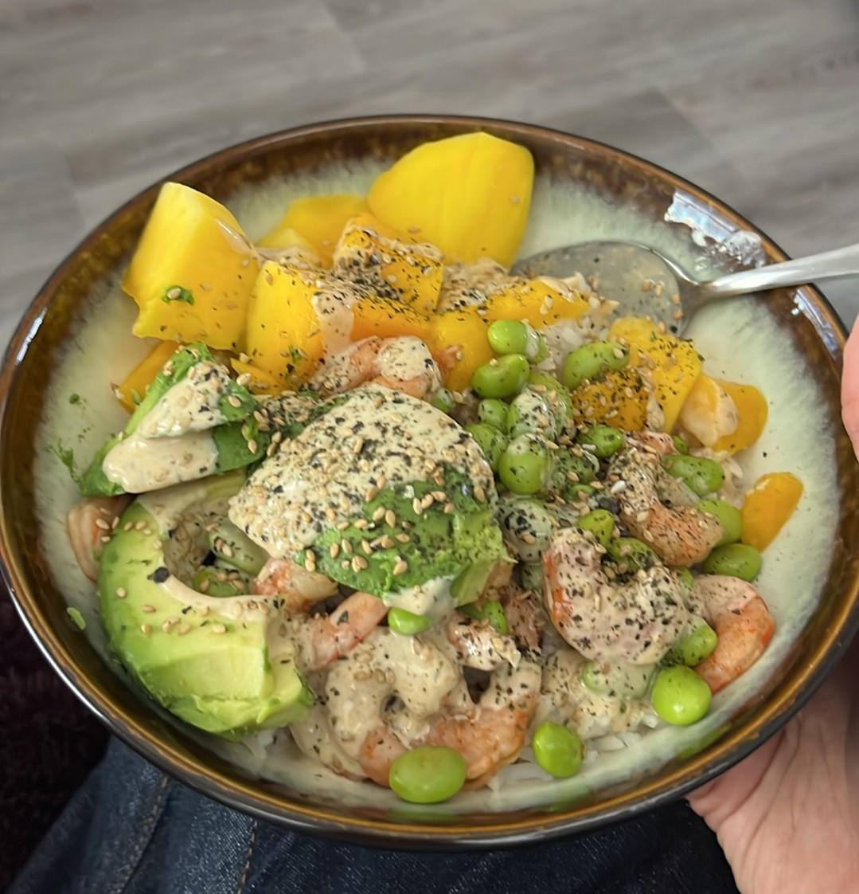

**Ingredients**
*Serves 2*

- Sushi rice:
  - 1.5 cups of white rice (or cauliflower rice)
  - 1.5 cups of water
  - 4 Tbsp rice vinegar
  - 2 Tbsp sugar
  - 1 tsp kosher salt
- Sauce:
  - 1/3 cup of mayo
  - 2 Tbsp soy sauce
  - 1 Tbsp rice vinegar
- avocado
- cucumber
- frozen prawns
- frozen mango
- frozen edamame
- ginger powder
- sesame seeds
- seaweed flakes

**Directions**

1. Defrost prawns, edamame, mango if frozen.
1. Cook rice. Once done mix in vinegar, sugar, and salt.
1. Cut cucumber and avocado into slices.
1. Mix sauce from mayo, soy sauce, and rice vinegar.
1. Plate prawns, avocado, cucumber, mango, and edamame over rice. Top with sauce, ginger powder, sesame seeds, and seaweed flakes.

